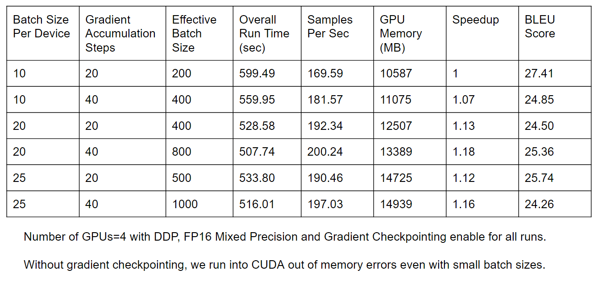

# High-Performance-ML-Project
requirements.txt: sets up the environment to run on GCP instance.  
t5_translate.py: python code for fine-tuning and evaluating t5-small model.  
README.docx: contains project description and results  
Small-100 (directory)  
- SmallTranslation.py
- data_prep.py
- tokenization_small100.py

## Table for SMaLL-100: Mixed Precision + varying Batch Size, Gradient Accumulation, and Gradient Checkpointing

__Observations__:

As the effective batch size increases, there is a speedup in training time along with an increase in throughput.

There is a 1.16x increase in sentence pair throughput between the worst and best cases.

There is an increase in memory footprint on the GPU as effective batch size increases even though gradient accumulation and gradient checkpointing should increase train time due in favor of memory accommodation.

BLEU scores were computed on a very limited testing set due to large evaluation time overhead. Nonetheless, there isn’t large variation in the scores across runs suggesting lack of improvement (use better optimizers and scale learning rates).
